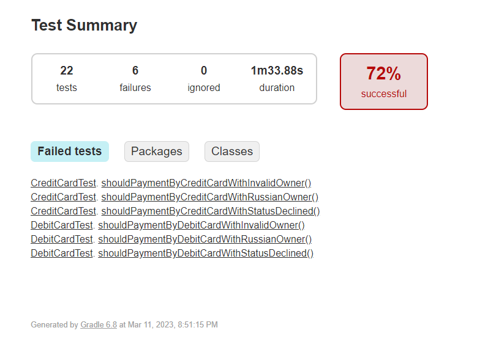
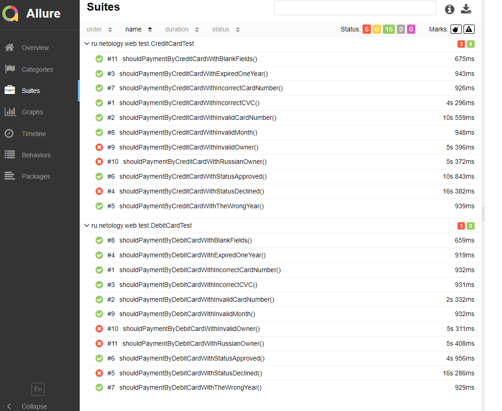

# Отчет по итогам автоматизированного тестирования

## Тестирование выполнялось по следующим сценариям:

### Позитивные:
1. Оплата дебетовой картой со статусом APPROVED и валидными данными
2. Оплата кредитной картой со статусом APPROVED и валидными данными

### Негативные:
3. Оплата дебетовой картой со статусом DECLINED и валидными данными
4. Оплата дебетовой картой, все поля пустые
5. Оплата дебетовой картой, невалидный номер карты (неверный формат)
6. Оплата дебетовой картой, невалидный номер карты (не из списка, верный формат)
7. Оплата дебетовой картой, невалидный месяц карты
8. Оплата дебетовой картой, невалидный год карты (истекший)
9. Оплата дебетовой картой, невалидный год карты (несколько лет вперед)
10. Оплата дебетовой картой, невалидное имя владельца (символы и цифры)
11. Оплата дебетовой картой, невалидное имя владельца (кириллица)
12. Оплата дебетовой картой, невалидный CVC/CVV

13. Оплата кредитной картой со статусом DECLINED и валидными данными
14. Оплата кредитной картой, все поля пустые
15. Оплата кредитной картой, невалидный номер карты (неверный формат)
16. Оплата кредитной картой, невалидный номер карты (не из списка, верный формат)
17. Оплата кредитной картой, невалидный месяц карты
18. Оплата кредитной картой, невалидный год карты (истекший)
19. Оплата кредитной картой, невалидный год карты (несколько лет вперед)
20. Оплата кредитной картой, невалидное имя владельца (символы и цифры)
21. Оплата кредитной картой, невалидное имя владельца (кириллица)
22. Оплата кредитной картой, невалидный CVC/CVV

## Использовались следующие инструменты:

* Система контроля версий: Git.
* Сервис онлайн-хостинга: GitHub.
* Язык:Java SE 11 (Java JDK 11).
* Среда разработки: IntelliJ IDEA.
* Тестовый Фреймворк: JUnit 5.
* Библиотеки, плагины: Selenide, Lombok, Rest Assured, JavaFaker.
* Репортинг и CI: Gradle, Allure.
* Контейнеризация: Docker.

## **Количество тест-кейсов**

* всего 22
* passed 16 (72,72%)
* failed 6 (27,28%)

## **Отчеты:**
### **Gradle**

### **Allure**

#### **Обнаруженные проблемы:**
- [Оплата картой со статусом DECLINED одобряется банком](https://github.com/EvgeniaRepina/QADiploma/issues/2#issue-1145837968)
- [Одобряется операция с невалидными символами в поле "Владелец"](https://github.com/EvgeniaRepina/QADiploma/issues/3#issue-1145899939)
- [При отклонении операции покупки видны два уведомления: об успешности и об ошибке](https://github.com/EvgeniaRepina/QADiploma/issues/4#issue-1145961233)

#### **Общие рекомендации:**
Согласно списку проблем, необходимо обратить внимание на модули работы с БД (проверку статуса карты), валидацию поля 
"Владелец" а также проверить атрибуты элементов в коде станицы. 
